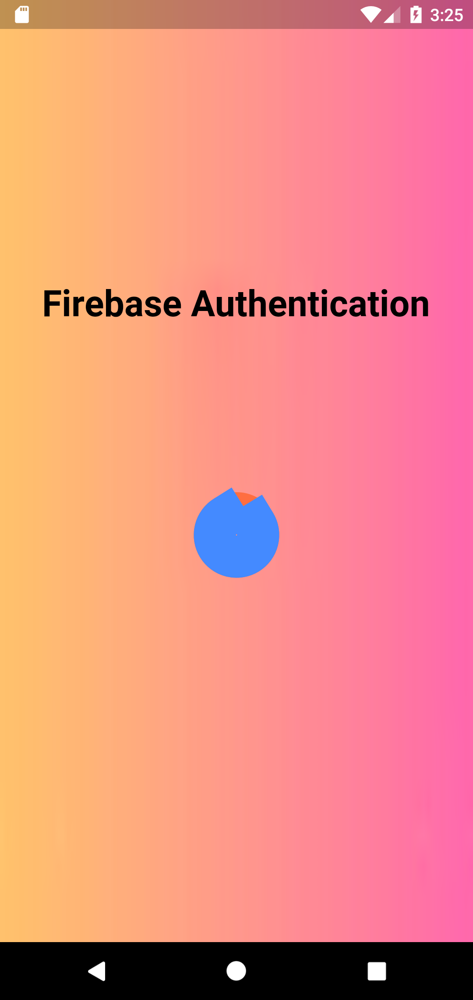
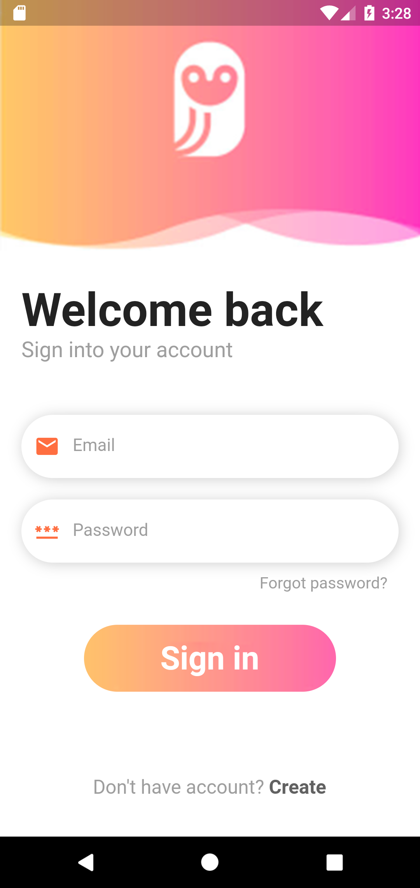
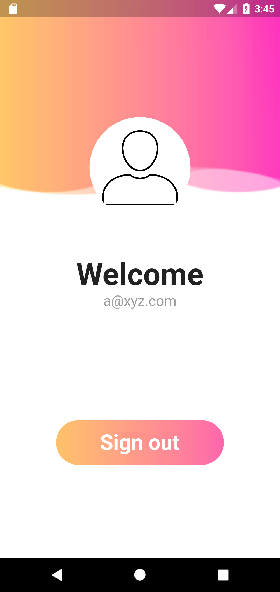

# Flutter Login Screen with Firebase Auth

A new Flutter project for user sign in or login with email and password with all default error messages with snackbar.  
This application also involves the splash screen for enhancement for UI.  
Video is linked for functionality reference and for a go through with this flutter application.

 ## Snapshots
 &nbsp;  &nbsp;  &nbsp; 

## Features

A fully functional app that provides Flutter developers with a coded template for their mobile app projects. It has a great number of popular features:

* Firebase Auth integration
* Login with e-mail & password
* Persistent Login Credentials
* Visual Error Handling
* Logout Functionality
* Splash Screen

## Fully Functional Screens

* Walkthrough flow
* Splash Screen
* Login Screen
* Sign up Screen
* Welcome Screen

## Other advantages

* Beautiful UI
* Optimized for both iOS and Android
* Modularized Code
* Loading States
* Error Handling

## Demo Video

https://user-images.githubusercontent.com/84095538/179352720-3bc3f9ed-0450-4005-b9a1-4a33649cf909.mp4

 
## Refernce
A few resources to get you started if this is your first Flutter project:

- [Lab: Write your first Flutter app](https://docs.flutter.dev/get-started/codelab)
- [Cookbook: Useful Flutter samples](https://docs.flutter.dev/cookbook)

For help getting started with Flutter development, view the
[online documentation](https://docs.flutter.dev/), which offers tutorials,
samples, guidance on mobile development, and a full API reference.

